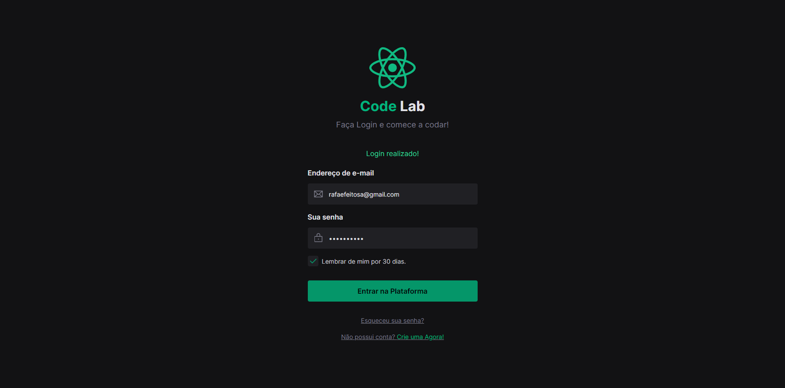

 
  
  <a href="https://github.com/Rafeso/Ignite-lab/commits/master">
    
  </a>
    
   
   <a href="https://github.com/Rafeso/Ignite-lab/stargazers">
    
  </a>

  <a href="https://www.linkedin.com/in/rafael-feitosa-618472241/">
    
 </a>

<h1 align="center">
    🚀 Ignite Lab - Design System
</h1>

<h4 align="center"> 
	✔  Ignite Lab 🚀 Concluído  ✔
</h4>

<p align="center">
 <a href="#-sobre-o-projeto">Sobre</a> •
 <a href="#-funcionalidades">Funcionalidades</a> •
 <a href="#-layout">Layout</a> • 
 <a href="#-como-executar-o-projeto">Como executar</a> • 
 <a href="#-tecnologias">Tecnologias</a> • 
 <a href="#-autor">Autor</a> • 
 <a href="#user-content--licença">Licença</a>
</p>


## 💻 Sobre o projeto

📔 Design System - Ignite Lab


Projeto desenvolvido durante o **Ignite Lab** oferecida pela [Rocketseat](https://www.rocketseat.com.br//).
O Ignite Lab foi uma experiência online com muito conteúdo prático, desafios e hacks onde o conteúdo ficou disponível durante três dias.

---

## 🎨 Layout

O layout da aplicação está disponível no Figma:

<a href="https://www.figma.com/file/UT1l6W7CnEmH2IiwoS1Mqa/Ignite_Lab?node-id=0%3A1">
  
</a>


### Web

<p align="center" style="display: flex; align-items: flex-start; justify-content: center;">
  

  
</p>

---

## 🚀 Como executar o projeto

Este Projeto é divido em três etapas:
1. Localhost com vite para visualizar o Formulário de Login
2. Localhost com storybook para visualizar a documentação do design system
3. Testes de componentes com [storybook interaction test](https://www.npmjs.com/package/@storybook/addon-interactions)

### Pré-requisitos

Antes de começar, você vai precisar ter instalado em sua máquina as seguintes ferramentas:
[Git](https://git-scm.com), [Node.js](https://nodejs.org/en/).

**Instale a versão LTS do Node.JS** 
 
Além disto é bom ter um editor para trabalhar com o código como [VSCode](https://code.visualstudio.com/)


#### 🧭 Rodando a aplicação web (Vite)

```bash

# Clone este repositório
$ git clone git@github.com:Rafeso/ignite-lab.git

# Acesse a pasta do projeto no seu terminal/cmd
$ cd ignite-lab

# Instale as dependências
$ npm install

# Execute a aplicação em modo de desenvolvimento
$ npm run dev

# A aplicação será aberta na porta:5173 - acesse http://localhost:5173

```
#### 🧭 Rodando o Storybook (Design System)

```bash

# Clone este repositório
$ git clone git@github.com:Rafeso/ignite-lab.git

# Acesse a pasta do projeto no seu terminal/cmd
$ cd ignite-lab

# Instale as dependências
$ npm install

# Execute a aplicação em modo de desenvolvimento
$ npm run storybook

# Se desejar pode executar o comando test (Só funciona quando o storybook está aberto na porta 6006)
$ npm run test

# A aplicação será aberta na porta:6006 - acesse http://localhost:6006

```


---

## 🛠 Tecnologias

As seguintes ferramentas foram usadas na construção do projeto:

-   **[Node.js](https://nodejs.org/en/)**
-   **[React](https://pt-br.reactjs.org/)**
-   **[TypeScript](https://www.typescriptlang.org/)**
-   **[React Icons](https://react-icons.github.io/react-icons/)**
-   **[Storybook](https://storybook.js.org/)**
-   **[Radix](https://www.radix-ui.com/)**
-   **[Tailwind](https://tailwindcss.com/)**
-  **[PostCSS](https://postcss.org/)**

> Veja o arquivo  [package.json](https://github.com/Rafeso/ignite-lab/blob/main/package.json)

#### [](https://github.com/Rafeso/ignite-lab#utilit%C3%A1rios)**Utilitários**

-   Protótipo:  **[Figma](https://www.figma.com/)**  →  **[Protótipo (Ignite Lab - Design System)](https://www.figma.com/file/UT1l6W7CnEmH2IiwoS1Mqa/Ignite_Lab)**
-   Editor:  **[Visual Studio Code](https://code.visualstudio.com/)**  → Extensions:  **[Tailwind CSS IntelliSense](https://marketplace.visualstudio.com/items?itemName=bradlc.vscode-tailwindcss)**, **[PostCSS Language Support](https://marketplace.visualstudio.com/items?itemName=csstools.postcss)**
-   Markdown:  **[StackEdit](https://stackedit.io/)**
-   Commit Conventional:  **[Commitlint](https://github.com/conventional-changelog/commitlint)**
-   Teste de Componentes:  **[MSW](https://mswjs.io/)**
-   Ícones:  **[Phosphor Icons](https://phosphoricons.com/?ref=madewithreactjs.com)**
-   Fontes:  **[Inter](https://fonts.google.com/specimen/Inter)**


---


## 💪 Como contribuir para o projeto

1. Faça um **fork** do projeto.
2. Crie uma nova branch com as suas alterações: `git checkout -b my-feature`
3. Salve as alterações e crie uma mensagem de commit contando o que você fez: `git commit -m "feature: My new feature"`
4. Envie as suas alterações: `git push origin my-feature`
> Caso tenha alguma dúvida confira este [guia de como contribuir no GitHub](./CONTRIBUTING.md)

---

## 🦸 Autor

<a href="https://github.com/Rafeso">
 
 <br />
 <sub><b>Rafael Feitosa</b></sub></a> <a href="#">☕</a>
 <br />
 
 [](https://www.linkedin.com/in/rafael-feitosa-618472241/) 
[](https://github.com/Rafeso)

---

## 📝 Licença

Este projeto esta sobe a licença [MIT](./LICENSE).

Feito com ❤️ por Rafael Feitosa 👋🏽 [Entre em contato!](https://www.linkedin.com/in/rafael-feitosa-618472241/)

---
